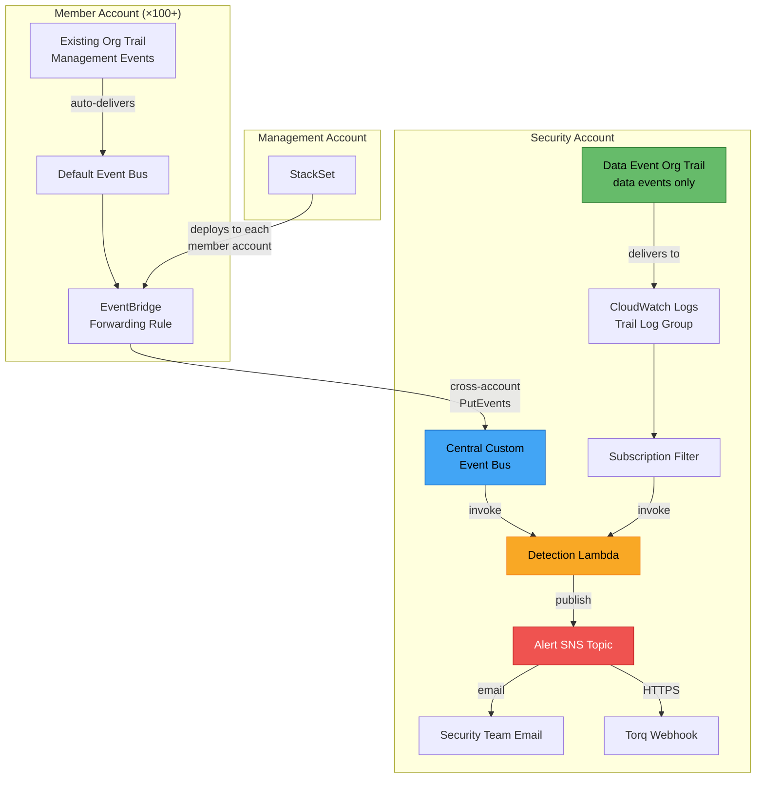
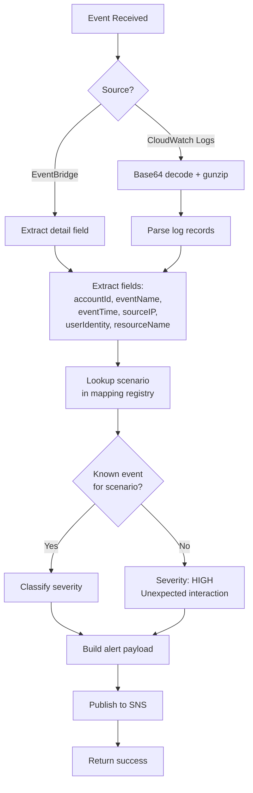

# Design Document: Deception Monitoring Stack

## Overview

This design describes a hybrid monitoring and alerting architecture that detects attacker interactions with honeypot/decoy resources deployed across 100+ AWS accounts. The system ingests CloudTrail events through two complementary paths — management events via EventBridge and data events via a dedicated scoped org trail — and funnels them into a single Detection Lambda in the security account for enrichment and alerting.

### Design Goals

- **Near real-time detection**: Alerts within seconds of attacker interaction with any decoy resource
- **Cost efficiency**: Total monitoring stack under $1/month across all accounts (the existing org trail and Secrets Manager costs from scenarios are excluded)
- **Zero-touch coverage**: New accounts automatically receive monitoring via StackSets
- **Actionable alerts**: Enriched with scenario context, severity, and raw event data for both human triage (email) and automated response (Torq webhook)

### Detection Strategy Rationale

The monitoring stack is deliberately tuned for **high-confidence, low-noise alerts** using a narrow detection surface:

**Why list/describe/enumerate calls are excluded:** Broad enumeration API calls (`ListBuckets`, `ListSecrets`, `DescribeParameters`, `ListTables`, `ListQueues`, `ListTopics`, `ListFunctions`, `ListRoles`, `ListAliases`, `ListKeys`, `DescribeLogGroups`, `ListStacks`, `ListSAMLProviders`, `ListExports`, `DescribeLogStreams`, `ListImages`, `DescribeRepositories`, `GetAuthorizationToken`, `ListGrants`, `ListRoleTags`, `GetResources`) are made routinely by legitimate users, AWS Config, Security Hub, SSO, and automation tools. Including them would generate a constant stream of false positives across 100+ accounts, drowning real alerts in noise. These calls return every resource of a type without targeting a specific one — they don't indicate the caller has identified or is investigating a decoy resource.

**Why only two severity tiers:** With enumeration calls removed from monitoring, the previous MEDIUM tier (which housed those calls) is no longer needed. The remaining monitored events fall cleanly into two categories:
- **CRITICAL** — Resource-specific data access and interaction events. The attacker has identified a specific decoy resource and is actively extracting data or modifying infrastructure.
- **HIGH** — Role assumption events (`AssumeRole`, `AssumeRoleWithSAML`) targeting decoy roles, plus any unexpected event name for a known resource. Role assumption is the entry point — it confirms the attacker found the lure role but hasn't yet accessed data.

This two-tier model simplifies alert triage: every alert is actionable, and severity directly indicates whether the attacker is at the "discovery" stage (HIGH) or "exploitation" stage (CRITICAL).

### Why a Hybrid Approach

A single-path architecture cannot satisfy both cost and coverage constraints:

| Approach | Management Events | Data Events | Monthly Cost (100 accounts) |
|----------|------------------|-------------|----------------------------|
| **EventBridge only** | ✅ Free (existing org trail) | ❌ Not available via EventBridge | ~$0.00 |
| **2nd org trail (all events)** | ✅ Logged | ✅ Logged | ~$30,000+ (management events alone) |
| **Dedicated data-only org trail** | ❌ Not logged | ✅ Scoped to decoys only | ~$0.06 |
| **Hybrid (this design)** | ✅ Via EventBridge | ✅ Via scoped data trail | **~$0.50** |

The hybrid approach uses EventBridge forwarding for management events (free, leveraging the existing org trail) and a dedicated org trail that logs ONLY data events scoped to decoy resource ARNs (~$0.06/month). Both paths converge on the same Detection Lambda.

## Architecture

### High-Level Architecture Diagram



### Event Flow — Management Events (Path 1)

1. Attacker interacts with a decoy resource (e.g., `sts:AssumeRole` on `payment-secrets-readonly-role`)
2. The existing org trail logs the management event to CloudTrail
3. CloudTrail automatically delivers the event to the default EventBridge bus in the member account
4. The EventBridge forwarding rule matches the event against decoy resource name patterns
5. Matched events are forwarded cross-account to the Central Event Bus in the security account
6. The Central Event Bus invokes the Detection Lambda
7. The Detection Lambda enriches the event and publishes to SNS

### Event Flow — Data Events (Path 2)

1. Attacker performs a data-plane operation (e.g., `s3:GetObject` on `infra-terraform-state-*`)
2. The dedicated data event org trail captures the event (scoped via advanced event selectors)
3. The trail delivers the event to a CloudWatch Logs log group in the security account
4. A CloudWatch Logs subscription filter matches decoy resource identifiers
5. The subscription filter invokes the Detection Lambda with the compressed log payload
6. The Detection Lambda decompresses, parses, enriches, and publishes to SNS

### Latency Characteristics

| Path | Expected Latency | Bottleneck |
|------|------------------|------------|
| Management events (EventBridge) | 5–15 seconds | CloudTrail → EventBridge delivery |
| Data events (CloudWatch Logs) | 15–60 seconds | CloudTrail → CloudWatch Logs → Subscription filter |

## Components and Interfaces

### 1. EventBridge Forwarding Rule (per member account)

**Purpose**: Match CloudTrail management events involving decoy resources and forward them cross-account.

**Deployed via**: StackSet to all member accounts

**Event pattern**: Matches on `detail.eventName` for monitored events only, combined with `detail.requestParameters` fields containing decoy resource identifiers. The rule filters on specific event names to exclude all broad enumeration calls and only match resource-specific API calls targeting lure resources.

```json
{
  "source": ["aws.iam", "aws.s3", "aws.secretsmanager", "aws.ssm", "aws.lambda",
             "aws.dynamodb", "aws.sqs", "aws.sns", "aws.kms", "aws.logs",
             "aws.ecr", "aws.cloudformation", "aws.sts", "aws.ec2", "aws.tag"],
  "detail-type": ["AWS API Call via CloudTrail"],
  "detail": {
    "eventName": [
      "AssumeRole", "AssumeRoleWithSAML",
      "GetObject", "GetSecretValue", "GetParameter", "GetParametersByPath",
      "Scan", "Query", "GetItem", "ReceiveMessage",
      "BatchGetImage", "GetDownloadUrlForLayer",
      "StartInstances", "AuthorizeSecurityGroupIngress",
      "Decrypt", "DescribeKey", "DescribeStacks", "DescribeTable",
      "GetTopicAttributes", "GetQueueAttributes",
      "GetFunctionConfiguration20150331v2", "GetSAMLProvider",
      "GetLogEvents", "FilterLogEvents",
      "ListSubscriptionsByTopic", "Publish"
    ],
    "$or": [
      { "requestParameters": { "roleName": [
        "infra-s3-data-readonly-role", "payment-secrets-readonly-role",
        "infra-config-readonly-role", "devops-s3-deploy-role",
        "prod-bastion-ecr-role", "lambda-ops-readonly-role",
        "compliance-audit-readonly-role", "prod-compliance-data-access-role",
        "prod-microservice-auth-role", "prod-microservice-data-role",
        "prod-microservice-admin-role", "customer-data-readonly-role",
        "session-store-readonly-role", "payment-queue-readonly-role",
        "alerts-readonly-role", "log-analysis-readonly-role",
        "kms-audit-readonly-role", "sso-audit-readonly-role",
        "resource-inventory-readonly-role", "etl-ops-readonly-role",
        "cfn-audit-readonly-role", "infra-params-readonly-role"
      ]}},
      { "requestParameters": { "functionName": [
        "prod-data-sync-processor", "prod-compliance-report-generator",
        "prod-user-data-enrichment"
      ]}},
      { "requestParameters": { "tableName": [
        "prod-customer-profiles", "prod-active-sessions",
        "prod-enriched-user-profiles"
      ]}},
      { "requestParameters": { "name": [
        "prod-alerts-critical", "ProdOktaSSO"
      ]}},
      { "requestParameters": { "keyId": [{ "prefix": "alias/prod-customer-data-encryption" }] }},
      { "requestParameters": { "logGroupName": ["/prod/payment-service/application"] }},
      { "requestParameters": { "repositoryName": ["prod-payment-service"] }},
      { "requestParameters": { "stackName": [{ "prefix": "prod-core-infrastructure" }] }}
    ]
  }
}
```

**Target**: Cross-account EventBridge target pointing to the Central Event Bus ARN in the security account. Requires an IAM role in the member account with `events:PutEvents` permission on the central bus.

### 2. Central Event Bus (security account)

**Purpose**: Single ingestion point for all forwarded management events.

**Resource policy**: Allows `events:PutEvents` from any principal in the organization using `aws:PrincipalOrgID` condition.

```json
{
  "Version": "2012-10-17",
  "Statement": [{
    "Sid": "AllowOrgPutEvents",
    "Effect": "Allow",
    "Principal": "*",
    "Action": "events:PutEvents",
    "Resource": "arn:aws:events:<region>:<security-account-id>:event-bus/deception-central-bus",
    "Condition": {
      "StringEquals": {
        "aws:PrincipalOrgID": "<org-id>"
      }
    }
  }]
}
```

**Rule**: A single rule on the central bus matches all events and invokes the Detection Lambda.

### 3. Data Event Org Trail (security account)

**Purpose**: Log data-plane events for decoy resources across all accounts.

**Critical constraints**:
- `IsMultiRegionTrail`: true (organization trail)
- `IsOrganizationTrail`: true
- `EnableLogFileValidation`: true
- Management events: **DISABLED** (`ReadWriteType: None` or excluded via advanced event selectors)
- Data events: Scoped exclusively to decoy resource ARNs

**Advanced Event Selectors**:

```yaml
AdvancedEventSelectors:
  # S3 data events — scoped to decoy buckets
  - Name: DeceptionS3DataEvents
    FieldSelectors:
      - Field: eventCategory
        Equals: [Data]
      - Field: resources.type
        Equals: [AWS::S3::Object]
      - Field: resources.ARN
        StartsWith:
          - arn:aws:s3:::infra-terraform-state-
          - arn:aws:s3:::devops-deploy-keys-
          - arn:aws:s3:::compliance-audit-reports-
          - arn:aws:s3:::prod-data-sync-artifacts-

  # DynamoDB data events — scoped to decoy tables
  - Name: DeceptionDynamoDBDataEvents
    FieldSelectors:
      - Field: eventCategory
        Equals: [Data]
      - Field: resources.type
        Equals: [AWS::DynamoDB::Table]
      - Field: resources.ARN
        EndsWith:
          - /prod-customer-profiles
          - /prod-active-sessions
          - /prod-enriched-user-profiles

  # SQS data events — scoped to decoy queues
  - Name: DeceptionSQSDataEvents
    FieldSelectors:
      - Field: eventCategory
        Equals: [Data]
      - Field: resources.type
        Equals: [AWS::SQS::Queue]
      - Field: resources.ARN
        EndsWith:
          - /prod-payment-events.fifo
          - /prod-payment-events-dlq.fifo

  # CloudWatch Logs data events — scoped to decoy log group
  - Name: DeceptionCloudWatchLogsDataEvents
    FieldSelectors:
      - Field: eventCategory
        Equals: [Data]
      - Field: resources.type
        Equals: [AWS::Logs::LogGroup]
      - Field: resources.ARN
        EndsWith:
          - /prod/payment-service/application
```

**Delivery**: Events are delivered to a CloudWatch Logs log group in the security account (`/aws/cloudtrail/deception-data-events`).

### 4. CloudWatch Logs Subscription Filter (security account)

**Purpose**: Stream data event log entries to the Detection Lambda.

**Filter pattern**: Matches log entries containing any decoy resource identifier. Uses a CloudWatch Logs filter pattern that matches on key resource names:

```
?"infra-terraform-state-" ?"devops-deploy-keys-" ?"compliance-audit-reports-" ?"prod-data-sync-artifacts-" ?"prod-customer-profiles" ?"prod-active-sessions" ?"prod-enriched-user-profiles" ?"prod-payment-events" ?"prod/payment-service/application"
```

The `?` prefix means OR — any matching term triggers delivery.

**Destination**: The Detection Lambda function ARN.

### 5. Detection Lambda (security account)

**Purpose**: Unified event processor for both management and data events. Enriches events with scenario metadata and publishes structured alerts.

**Runtime**: Python 3.12  
**Memory**: 256 MB  
**Timeout**: 30 seconds  
**Reserved concurrency**: 10 (cost guardrail)

**Input sources**:
- EventBridge (management events): Event arrives as a standard EventBridge event envelope with the CloudTrail event in `detail`
- CloudWatch Logs (data events): Event arrives as a base64-encoded, gzip-compressed payload containing one or more log records

**Processing flow**:



**Severity classification**:

| Severity | Event Names |
|----------|-------------|
| CRITICAL | GetSecretValue, GetObject, Scan, Query, GetItem, ReceiveMessage, GetLogEvents, BatchGetImage, Decrypt, GetFunctionConfiguration20150331v2, DescribeStacks, DescribeKey, GetSAMLProvider, GetTopicAttributes, GetQueueAttributes, ListSubscriptionsByTopic, FilterLogEvents, GetDownloadUrlForLayer, StartInstances, AuthorizeSecurityGroupIngress, Publish, GetParameter, GetParametersByPath, DescribeTable |
| HIGH | AssumeRole, AssumeRoleWithSAML (targeting decoy roles), plus any unexpected event for a known resource |

### 6. Alert SNS Topic (security account)

**Purpose**: Fan-out alerts to email and Torq webhook.

**Subscriptions** (max 10 per cost guardrail):
- Email subscription for the security team
- HTTPS subscription pointing to the Torq webhook URL

**Message structure**: The Detection Lambda publishes with `MessageStructure: json` to send different payloads per protocol:
- **Email**: Human-readable formatted text with severity, scenario, account, event details
- **HTTPS (Torq)**: Structured JSON with all fields including the raw CloudTrail event

### 7. StackSet (management account)

**Purpose**: Deploy per-account monitoring components consistently across all member accounts.

**Template contents**:
- EventBridge forwarding rule on the default bus
- IAM role for cross-account EventBridge PutEvents
- IAM role trust policy scoped to the EventBridge service

**Parameters**:
- `CentralEventBusArn`: ARN of the central event bus in the security account
- `SecurityAccountId`: Account ID of the security account

**Deployment**: Service-managed StackSet with automatic deployment to new accounts in the organization.

## Data Models

### Alert Payload (SNS Message — JSON for Torq)

```json
{
  "severity": "CRITICAL | HIGH",
  "scenario_number": 2,
  "scenario_description": "Secrets Manager Payment Credentials Lure",
  "account_id": "123456789012",
  "event_name": "GetSecretValue",
  "event_time": "2025-01-15T14:32:07Z",
  "source_ip": "198.51.100.42",
  "user_identity_arn": "arn:aws:sts::123456789012:assumed-role/attacker-role/session",
  "resource_name": "prod/payment-gateway/stripe-keys",
  "region": "us-west-2",
  "raw_event": { }
}
```

### Alert Payload (SNS Message — Email)

```
🚨 DECEPTION ALERT — CRITICAL

Scenario:    #2 — Secrets Manager Payment Credentials Lure
Account:     123456789012
Event:       GetSecretValue
Time (UTC):  2025-01-15T14:32:07Z
Source IP:   198.51.100.42
User:        arn:aws:sts::123456789012:assumed-role/attacker-role/session
Resource:    prod/payment-gateway/stripe-keys
Region:      us-west-2
```

### Scenario-to-Event Mapping Registry

The Detection Lambda contains an embedded mapping registry. Each entry maps a scenario number to its decoy resource names and expected monitored CloudTrail event names. Only resource-specific API calls are included — no broad enumeration calls.

```python
SCENARIO_REGISTRY = {
    1: {
        "description": "S3 Terraform State Lure",
        "resources": ["infra-terraform-state-", "infra-s3-data-readonly-role"],
        "events": ["AssumeRole", "GetObject"],
        "resource_match": "prefix"
    },
    2: {
        "description": "Secrets Manager Payment Credentials Lure",
        "resources": ["prod/payment-gateway/", "prod/internal-api/service-accounts",
                      "payment-secrets-readonly-role"],
        "events": ["AssumeRole", "GetSecretValue"],
        "resource_match": "prefix"
    },
    3: {
        "description": "SSM Parameter Store Infrastructure Vault",
        "resources": ["/prod/database/", "/prod/ci-cd/", "/prod/monitoring/",
                      "/prod/vpn/", "/prod/kubernetes/", "infra-config-readonly-role"],
        "events": ["AssumeRole", "GetParameter", "GetParametersByPath"],
        "resource_match": "prefix"
    },
    4: {
        "description": "S3 SSH Key to EC2 Bastion Lure",
        "resources": ["devops-deploy-keys-", "devops-s3-deploy-role",
                      "prod-bastion-host", "prod-bastion-sg"],
        "events": ["AssumeRole", "GetObject", "AuthorizeSecurityGroupIngress", "StartInstances"],
        "resource_match": "prefix"
    },
    5: {
        "description": "ECR Container Image with PII Lure",
        "resources": ["prod-payment-service", "prod-bastion-ecr-role"],
        "events": ["BatchGetImage", "GetDownloadUrlForLayer"],
        "resource_match": "exact"
    },
    6: {
        "description": "Lambda Data Sync with Env Var Secrets Lure",
        "resources": ["prod-data-sync-processor", "prod-data-sync-artifacts-",
                      "prod/data-sync/", "lambda-ops-readonly-role"],
        "events": ["AssumeRole", "GetFunctionConfiguration20150331v2", "GetObject",
                   "GetSecretValue", "GetParameter"],
        "resource_match": "mixed"
    },
    7: {
        "description": "Lambda Role Chaining to Compliance Lures",
        "resources": ["prod-compliance-report-generator", "compliance-audit-reports-",
                      "prod/compliance/", "compliance-audit-readonly-role",
                      "prod-compliance-data-access-role"],
        "events": ["AssumeRole", "GetFunctionConfiguration20150331v2",
                   "GetObject", "GetSecretValue", "GetParameter"],
        "resource_match": "mixed"
    },
    8: {
        "description": "IAM Role Chain Loop",
        "resources": ["prod-microservice-auth-role", "prod-microservice-data-role",
                      "prod-microservice-admin-role", "/prod/auth/", "/prod/data/",
                      "/prod/admin/"],
        "events": ["AssumeRole", "GetParameter"],
        "resource_match": "mixed"
    },
    9: {
        "description": "DynamoDB Customer Profiles Lure",
        "resources": ["prod-customer-profiles", "customer-data-readonly-role"],
        "events": ["AssumeRole", "DescribeTable", "Scan", "Query", "GetItem"],
        "resource_match": "exact"
    },
    10: {
        "description": "DynamoDB Active Sessions Lure",
        "resources": ["prod-active-sessions", "session-store-readonly-role"],
        "events": ["AssumeRole", "DescribeTable", "Scan", "Query"],
        "resource_match": "exact"
    },
    11: {
        "description": "SQS Payment Events Dead Letter Queue Lure",
        "resources": ["prod-payment-events.fifo", "prod-payment-events-dlq.fifo",
                      "payment-queue-readonly-role"],
        "events": ["AssumeRole", "GetQueueAttributes", "ReceiveMessage"],
        "resource_match": "exact"
    },
    12: {
        "description": "SNS Critical Alerts Topic Lure",
        "resources": ["prod-alerts-critical", "alerts-readonly-role"],
        "events": ["AssumeRole", "GetTopicAttributes", "ListSubscriptionsByTopic", "Publish"],
        "resource_match": "exact"
    },
    13: {
        "description": "CloudWatch Logs Leaked Credentials Lure",
        "resources": ["/prod/payment-service/application", "log-analysis-readonly-role"],
        "events": ["AssumeRole", "GetLogEvents", "FilterLogEvents"],
        "resource_match": "exact"
    },
    14: {
        "description": "KMS Customer Data Encryption Key Lure",
        "resources": ["alias/prod-customer-data-encryption", "kms-audit-readonly-role"],
        "events": ["AssumeRole", "DescribeKey", "Decrypt"],
        "resource_match": "exact"
    },
    15: {
        "description": "SAML Provider Fake Okta SSO Lure",
        "resources": ["ProdOktaSSO", "sso-audit-readonly-role",
                      "prod-okta-admin-role", "prod-okta-developer-role"],
        "events": ["AssumeRole", "GetSAMLProvider", "AssumeRoleWithSAML"],
        "resource_match": "exact"
    },
    16: {
        "description": "Resource Tags Breadcrumb Trail Lure",
        "resources": ["resource-inventory-readonly-role"],
        "events": ["AssumeRole"],
        "resource_match": "exact"
    },
    17: {
        "description": "Lambda + DynamoDB Enriched User PII Lure",
        "resources": ["prod-user-data-enrichment", "prod-enriched-user-profiles",
                      "etl-ops-readonly-role"],
        "events": ["AssumeRole", "GetFunctionConfiguration20150331v2", "DescribeTable", "Scan"],
        "resource_match": "exact"
    },
    18: {
        "description": "SSM Parameter Cross-Reference Chain Lure",
        "resources": ["/prod/db/", "infra-params-readonly-role"],
        "events": ["AssumeRole", "GetParameter", "GetParametersByPath"],
        "resource_match": "prefix"
    },
    19: {
        "description": "CloudFormation Stack Outputs Exposed Secrets Lure",
        "resources": ["prod-core-infrastructure", "cfn-audit-readonly-role"],
        "events": ["AssumeRole", "DescribeStacks"],
        "resource_match": "exact"
    }
}
```

### Resource Matching Logic

The Detection Lambda uses a two-pass matching strategy:

1. **Extract resource identifier** from the CloudTrail event: check `requestParameters.roleName`, `requestParameters.functionName`, `requestParameters.tableName`, `requestParameters.bucketName`, `resources[].ARN`, and other service-specific fields.
2. **Match against registry**: For each scenario, compare the extracted identifier against the scenario's resource list using the specified match type (`exact`, `prefix`, or `mixed`).

### Cost Analysis

#### Detailed Cost Breakdown

| Component | Calculation | Monthly Cost |
|-----------|-------------|-------------|
| **EventBridge forwarding rules** | Free (default bus rules, no custom bus in member accounts) | $0.00 |
| **EventBridge cross-account events** | $1.00/million events × ~100 events/month | ~$0.00 |
| **Central Event Bus** | $1.00/million custom events | ~$0.00 |
| **Data Event Org Trail** | $0.10/100K data events × ~600 events/month | ~$0.00 |
| **CloudTrail data event logging** | First copy free (org trail), scoped to ~20 resources | ~$0.06 |
| **CloudWatch Logs (trail delivery)** | $0.50/GB ingestion × ~0.001 GB/month | ~$0.00 |
| **CloudWatch Logs subscription filter** | No additional charge | $0.00 |
| **Lambda invocations** | Free tier: 1M requests/month, ~100 invocations/month | $0.00 |
| **Lambda compute** | Free tier: 400K GB-seconds, ~100 × 0.256GB × 1s = 25.6 GB-s | $0.00 |
| **SNS email notifications** | Free (first 1,000 emails/month) | $0.00 |
| **SNS HTTPS notifications** | $0.60/million, ~100/month | ~$0.00 |
| **StackSet operations** | No additional charge | $0.00 |
| **IAM roles (per account)** | No charge | $0.00 |
| **Total** | | **~$0.06–$0.50/month** |

#### Cost Comparison: Why NOT a Second Full Trail

| Configuration | Monthly Cost | Risk |
|---------------|-------------|------|
| 2nd org trail with management events | ~$30,000 | $300/account × 100 accounts |
| 2nd org trail with unscoped data events | ~$100,000+ | All data events across all services |
| Dedicated trail, data events only, scoped | ~$0.06 | Minimal — only decoy resource events |
| **This design (hybrid)** | **~$0.50** | **Controlled — scoped selectors + EventBridge** |

The $30K/month figure comes from CloudTrail pricing: management events on a second trail cost ~$2.00 per 100K events. At 100 accounts generating ~150M management events/month total, that's ~$3,000/month for the trail alone, plus S3 storage. With data events unscoped, costs escalate to $100K+/month.

### CloudFormation Template Structure

The infrastructure is split into two templates:

#### Template 1: Security Account Stack (`monitoring-stack.yaml`)

```yaml
Parameters:
  SecurityAccountId
  OrganizationId
  TorqWebhookUrl
  AlertEmailAddress

Resources:
  # Central Event Bus + resource policy
  DeceptionCentralBus
  DeceptionCentralBusPolicy
  
  # Event bus rule → Lambda
  CentralBusDetectionRule
  
  # Data Event Org Trail
  DeceptionDataEventTrail
  DataEventTrailLogGroup
  DataEventTrailLogGroupRole
  
  # CloudWatch Subscription Filter
  DataEventSubscriptionFilter
  
  # Detection Lambda
  DetectionLambdaRole
  DetectionLambdaFunction
  DetectionLambdaEventBridgePermission
  DetectionLambdaCloudWatchPermission
  
  # SNS Topic + Subscriptions
  AlertSnsTopic
  AlertSnsEmailSubscription
  AlertSnsTorqSubscription
```

#### Template 2: Per-Account StackSet Template (`member-account-monitoring.yaml`)

```yaml
Parameters:
  CentralEventBusArn
  SecurityAccountId

Resources:
  # EventBridge forwarding rule
  DeceptionForwardingRule
  
  # IAM role for cross-account PutEvents
  EventBridgeForwardingRole
```

## Correctness Properties

*A property is a characteristic or behavior that should hold true across all valid executions of a system — essentially, a formal statement about what the system should do. Properties serve as the bridge between human-readable specifications and machine-verifiable correctness guarantees.*

The monitoring stack is primarily Infrastructure as Code (CloudFormation templates, EventBridge rules, CloudTrail configuration). IaC components are best validated with snapshot tests and smoke tests, not property-based testing. However, the Detection Lambda contains significant pure business logic — event parsing, scenario mapping, severity classification, and alert formatting — that is well-suited to property-based testing.

The following properties target the Detection Lambda's logic layer.

### Property 1: Event Selector Scope Validation

*For any* advanced event selector configuration, the deployment validator SHALL reject configurations that use wildcard-only resource selectors (no specific ARN patterns) and SHALL accept configurations that enumerate specific decoy resource ARN patterns.

**Validates: Requirements 2.5, 8.2**

### Property 2: Management Event Field Extraction

*For any* valid CloudTrail management event delivered via EventBridge, the event parser SHALL extract all six required fields (source account ID, event name, event time, source IP address, user identity ARN, and affected resource name) and each extracted field SHALL be non-empty.

**Validates: Requirements 5.1**

### Property 3: CloudWatch Logs Payload Decompression and Extraction

*For any* valid CloudTrail data event that is base64-encoded and gzip-compressed into CloudWatch Logs subscription format, the payload processor SHALL decompress the payload, parse the CloudTrail event records, and extract the same six fields as management events — producing results equivalent to directly parsing the uncompressed event.

**Validates: Requirements 5.2**

### Property 4: Resource-to-Scenario Mapping

*For any* decoy resource name present in the scenario registry, the mapping function SHALL return the correct scenario number and a non-empty scenario description, and the returned scenario number SHALL be one of the 19 defined scenarios (1–19).

**Validates: Requirements 5.3, 9.1**

### Property 5: Severity Classification (Two-Tier)

*For any* CloudTrail event name, the severity classifier SHALL return CRITICAL for resource-specific data access and interaction events (`GetSecretValue`, `GetObject`, `Scan`, `Query`, `GetItem`, `ReceiveMessage`, `GetLogEvents`, `BatchGetImage`, `Decrypt`, `GetFunctionConfiguration20150331v2`, `DescribeStacks`, `DescribeKey`, `GetSAMLProvider`, `GetTopicAttributes`, `GetQueueAttributes`, `ListSubscriptionsByTopic`, `FilterLogEvents`, `GetDownloadUrlForLayer`, `StartInstances`, `AuthorizeSecurityGroupIngress`, `Publish`, `GetParameter`, `GetParametersByPath`, `DescribeTable`), and HIGH for role assumption events (`AssumeRole`, `AssumeRoleWithSAML`) targeting decoy roles, with no event name mapping to more than one severity level.

**Validates: Requirements 5.4**

### Property 6: Alert Formatting Completeness

*For any* valid enriched alert payload, both the email formatter and the JSON formatter SHALL produce output containing all required fields: severity, scenario number, scenario description, account ID, event name, event time, source IP, user identity ARN, resource name, and region. For the JSON formatter, the output SHALL additionally include the raw CloudTrail event.

**Validates: Requirements 6.3, 6.4**

### Property 7: Unexpected Event Fallback Classification

*For any* decoy resource that maps to a known scenario, paired with an event name that is NOT in that scenario's expected event list, the Detection Lambda SHALL classify the event as severity HIGH and the alert description SHALL indicate an unexpected interaction pattern.

**Validates: Requirements 9.5**

## Error Handling

### Detection Lambda Error Handling

| Error Condition | Handling Strategy | Recovery |
|----------------|-------------------|----------|
| Malformed EventBridge event (missing `detail`) | Log error with full event payload to CloudWatch Logs, skip event | Continue processing next event |
| Malformed CloudWatch Logs payload (decompression failure) | Log error with raw payload, skip batch | Continue processing next invocation |
| Unknown resource (no scenario match) | Log as unmatched event with WARNING level, do NOT alert | Continue processing |
| SNS publish failure | Log error with full alert payload, raise exception for Lambda retry | Lambda retries up to 2 times (EventBridge) or DLQ (CloudWatch Logs) |
| Timeout approaching (>25s elapsed) | Flush any pending alerts, log partial processing warning | Lambda will be re-invoked for remaining events |

### EventBridge Forwarding Failures

- If the cross-account PutEvents call fails (e.g., permission denied), EventBridge retries for up to 24 hours with exponential backoff.
- Dead-letter queue (DLQ) on the forwarding rule captures events that exhaust retries.

### CloudWatch Logs Subscription Failures

- If the Detection Lambda is throttled (reserved concurrency exceeded), CloudWatch Logs retries delivery for up to 24 hours.
- Failed deliveries are visible in CloudWatch Logs subscription filter metrics.

### Cost Guardrail Enforcement

- The Detection Lambda's reserved concurrency of 10 prevents runaway invocations from a flood of events.
- The 30-second timeout prevents individual invocations from consuming excessive compute.
- If an attacker triggers a massive volume of events, the concurrency limit throttles processing, and events queue in EventBridge (24h retention) or CloudWatch Logs (retry buffer).

## Testing Strategy

### Testing Approach

This feature uses a **dual testing approach**:

1. **Property-based tests** for the Detection Lambda's pure logic functions (parsing, mapping, classification, formatting)
2. **Snapshot/unit tests** for CloudFormation template validation
3. **Integration tests** for end-to-end event flow verification

### Property-Based Testing

**Library**: [Hypothesis](https://hypothesis.readthedocs.io/) (Python, matching the Lambda runtime)

**Configuration**: Minimum 100 iterations per property test.

**Tag format**: `Feature: deception-monitoring-stack, Property {number}: {property_text}`

Each correctness property maps to a single property-based test:

| Property | Test Description | Generator Strategy |
|----------|-----------------|-------------------|
| 1 | Validate event selector scope checker | Generate random advanced event selector configs (scoped/unscoped) |
| 2 | Management event field extraction | Generate random CloudTrail event JSON with varying service types |
| 3 | CloudWatch Logs decompression + extraction | Generate CloudTrail events, compress into CW Logs format, verify round-trip |
| 4 | Resource-to-scenario mapping | Sample from all registered resource names, verify correct scenario |
| 5 | Severity classification (two-tier) | Generate event names from both severity categories (CRITICAL and HIGH), verify correct classification with no overlap |
| 6 | Alert formatting completeness | Generate random alert payloads, verify both email and JSON contain all fields |
| 7 | Unexpected event fallback | Generate (resource, non-matching-event) pairs, verify HIGH severity |

### Unit Tests (Example-Based)

| Test | What It Verifies |
|------|-----------------|
| Registry completeness | All 19 scenarios (1–19) present with correct event lists per requirements |
| Registry event accuracy | Each scenario's event list matches the specification exactly — no enumeration calls present |
| Registry no excluded events | No scenario contains any broad enumeration API call (ListBuckets, ListSecrets, etc.) |
| Error handling — malformed EventBridge event | Lambda logs error and continues |
| Error handling — decompression failure | Lambda logs error and continues |
| Error handling — SNS publish failure | Lambda raises for retry |

### Infrastructure Validation (Snapshot/Smoke Tests)

| Test | What It Verifies |
|------|-----------------|
| Security account template validity | Template parses as valid CloudFormation YAML |
| Member account template validity | Template parses as valid CloudFormation YAML |
| Template parameters | Required parameters (SecurityAccountId, CentralEventBusArn, TorqWebhookUrl, AlertEmailAddress) are present |
| Trail configuration | Data event trail has management events disabled |
| Trail advanced event selectors | Selectors enumerate specific ARN patterns, no wildcards |
| Lambda configuration | Reserved concurrency ≤ 10, timeout ≤ 30s |
| SNS subscription count | ≤ 10 subscriptions |
| EventBridge resource policy | Contains aws:PrincipalOrgID condition |
| EventBridge event pattern | Pattern includes `detail.eventName` filter with only monitored events, no enumeration calls |

### Integration Tests

| Test | What It Verifies |
|------|-----------------|
| End-to-end management event flow | Event on default bus → forwarding rule → central bus → Lambda → SNS |
| End-to-end data event flow | Data event → CloudTrail → CloudWatch Logs → subscription filter → Lambda → SNS |
| Cross-account forwarding | Event from member account reaches central bus |
